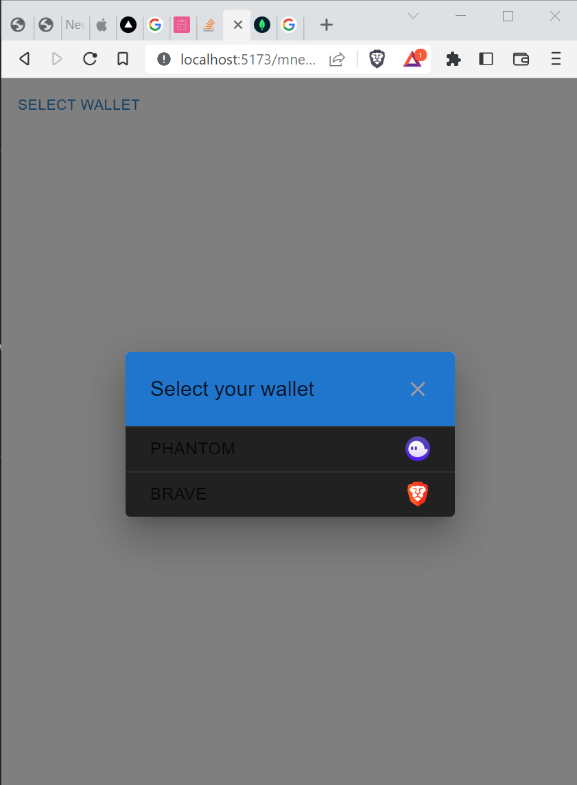
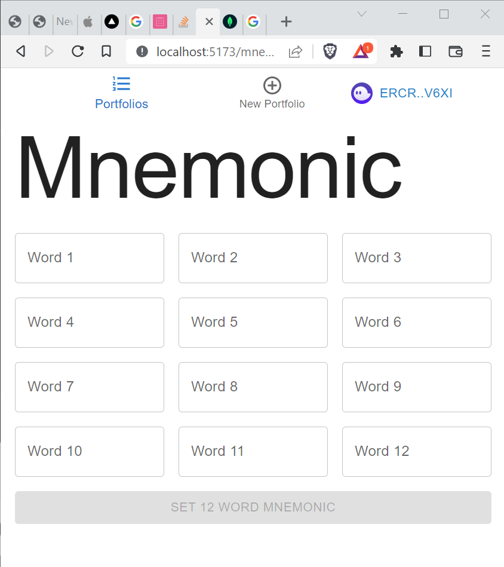
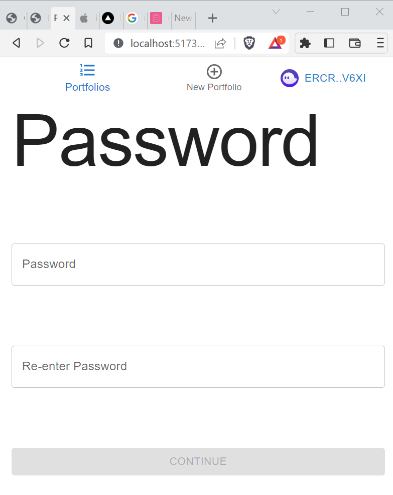
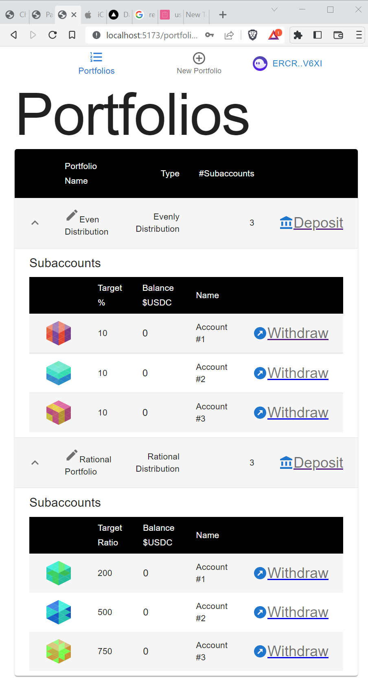
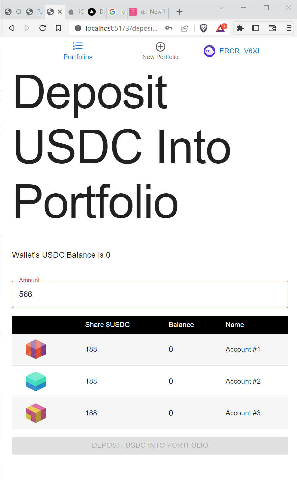

# Porfolio Solana USDC Wallet

Yet another Solana wallet with portfolio management features.

You can have portfolios with different portfolio distribution options.
- Even distribution, deposit amount is evently distributed among sub accounts.
- Rational distribution, deposit amount is distrinbuted rational to target amount.
- Waterfall distribution, deposit amount is distributed in a waterwall fashion. Consider a case with 3 portfolio subaccounts. Account#1 target $USDC 500, Account#2 target $USDC 500, and Account#3 target $USDC 500. When $USDC 750 is deposited into portfolio, Account #1 is credited with $500, and Account#2 $250.

# Supported Solana Wallets
- Phantom Wallet https://phantom.app/
- Brave Wallet (Brave Browser Wallet)

# Screenshots

Select wallet

Set 12 World Mnemonic

Set Password

Portfolios

Deposit Into Portfolio

# Tech Stack
## Frontend
React, MaterialUI, Typescript, Vite, React Hook Form, Redux Tool Kit aka. RTK

## Backend
NextJS, MongoDB, Serverless
